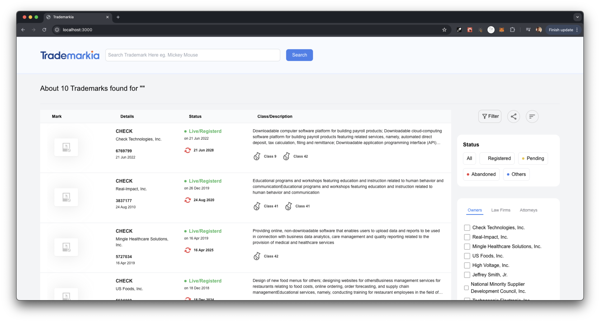
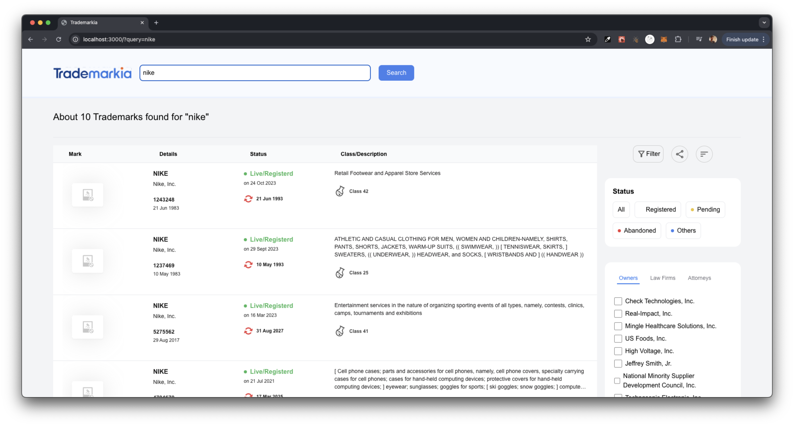
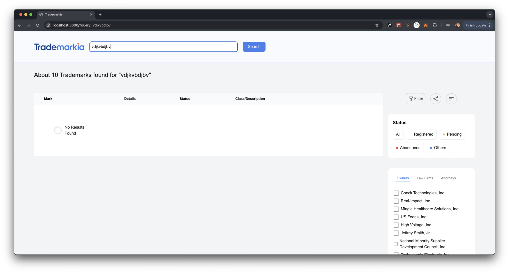
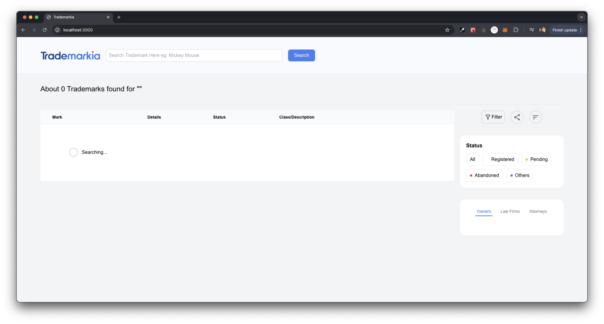

# `21BCE9789_Frontend`

Welcome to the `21BCE9789_Frontend` repository! This project is designed to offer a comprehensive search experience. Below is a detailed overview of the features and functionality implemented.

## Screenshots
Here are some screenshots of the website in different states:

1. **Default View**:
   

2. **Search Results**:
   

3. **No Results Found**:
   

4. **Loading State**:
   

## Features

### Search Functionality

- **Search Input**: Users can input their search queries into a text field.
- **Real-time Search**: As users type, the search input updates dynamically.
- **Search Button**: A dedicated button to initiate the search, with functionality to handle Enter key press for convenience.

### Search Results

- **Results Display**: Shows search results based on the user's query.
- **Loading States**: Includes loading indicators to inform users when results are being fetched.
- **Search Query Persistence**: The search query is persisted in the URL, allowing users to bookmark or share search results.

### Technical Details

- **Frontend**: Developed using React.js with Next.js for server-side rendering (SSR) and caching capabilities.
- **CSS Framework**: Utilizes Tailwind CSS for styling.
- **TypeScript**: Implemented for better type safety and code quality.
- **Search State Management**: Uses React hooks for managing search state and query parameters.

### Deployment

- **URL Handling**: The application uses URL query parameters to manage and display search results.
- **Responsive Design**: The application is designed to be responsive and accessible across various devices.

## Installation and Setup

To set up the project locally, follow these steps:

1. **Clone the Repository**:
   ```bash
   git clone https://github.com/ramtanniru/21BCE9789_Frontend.git
   ```
   
2. **Navigate to the Project Directory**:
   ```bash
   cd 21BCE9789_Frontend
   ```

3. **Install Dependencies**:
   ```bash
   npm install
   ```

4. **Run the Development Server**:
   ```bash
   npm run dev
   ```

   Open `http://localhost:3000` in your browser to view the application.

## Contributing

This repository is private. For any contributions or issues, please contact `recruitments@trademarkia.com`.


## Contact

For further information or questions, please reach out via the repository contact.

Thank you for checking out the my frontend task!
```
